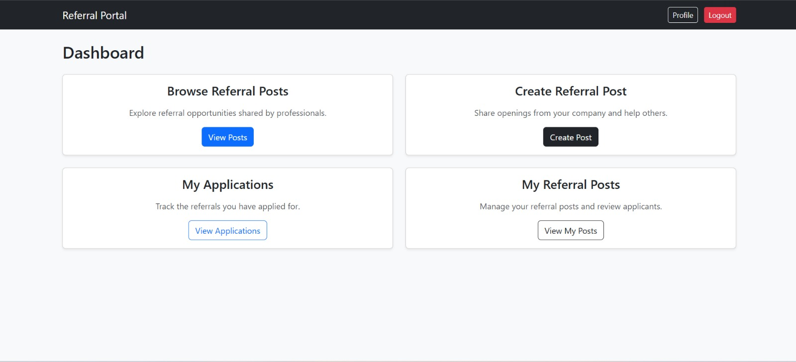

# ReferNow – Referral Networking Platform

ReferNow is a web platform that connects job seekers with employees willing to provide referrals.
Users can create referral posts, apply to referral opportunities, and communicate with referrers through the platform.

The goal of the platform is to simplify the referral process and help candidates connect with employees who can refer them to open positions.

---


## Dashboard



## Features

* User authentication and profile management
* Create referral posts for open roles
* Apply to referral posts with a message
* Prevent duplicate applications to the same referral post
* Prevent users from applying to their own referral posts
* Messaging system between referrer and candidate
* Secure backend APIs with authentication

---

## Tech Stack

**Backend**

* Python
* Django
* Django REST Framework

**Database**

* PostgreSQL

**Deployment**

* Render

**Frontend**

* HTML
* CSS
* JavaScript

---

## Project Structure

```
refernow/
│
├── referrals/              # Referral related models and APIs
│   ├── models.py
│   ├── serializers.py
│   ├── views.py
│   └── urls.py
│
├── users/                  # Custom user and profile models
│   ├── models.py
│   ├── views.py
│   └── serializers.py
│
├── manage.py
└── requirements.txt
```

---

## Installation

### 1. Clone the repository

```
git clone https://github.com/your-username/refernow.git
cd refernow
```

### 2. Create virtual environment

```
python -m venv venv
source venv/bin/activate
```

### 3. Install dependencies

```
pip install -r requirements.txt
```

### 4. Setup environment variables

Create a `.env` file and add:

```
DATABASE_URL=your_database_url
SECRET_KEY=your_secret_key
DEBUG=True
```

### 5. Run migrations

```
python manage.py migrate
```

### 6. Start development server

```
python manage.py runserver
```

Server will run at:

```
http://127.0.0.1:8000/
```

---

## API Overview

### Create Referral Post

```
POST /api/referrals/
```

Creates a new referral post.
The logged-in user automatically becomes the referrer.

---

### Apply to Referral Post

```
POST /api/applications/
```

Validation rules:

* Users cannot apply to their own referral post
* Duplicate applications are not allowed

---

### Messaging

Candidates and referrers can communicate through chat messages once an application is created.

---

## Database Design

Main tables used in the system:

```
users_user
users_profile
referrals_referralpost
referrals_referralapplication
referrals_application
referrals_chatmessage
```

Relationships:

```
User
 ├── ReferralPost (referrer)
 └── ReferralApplication (candidate)

ReferralApplication
 └── ChatMessage
```

## Author

Developed by **Pranjay Sidhwani**
